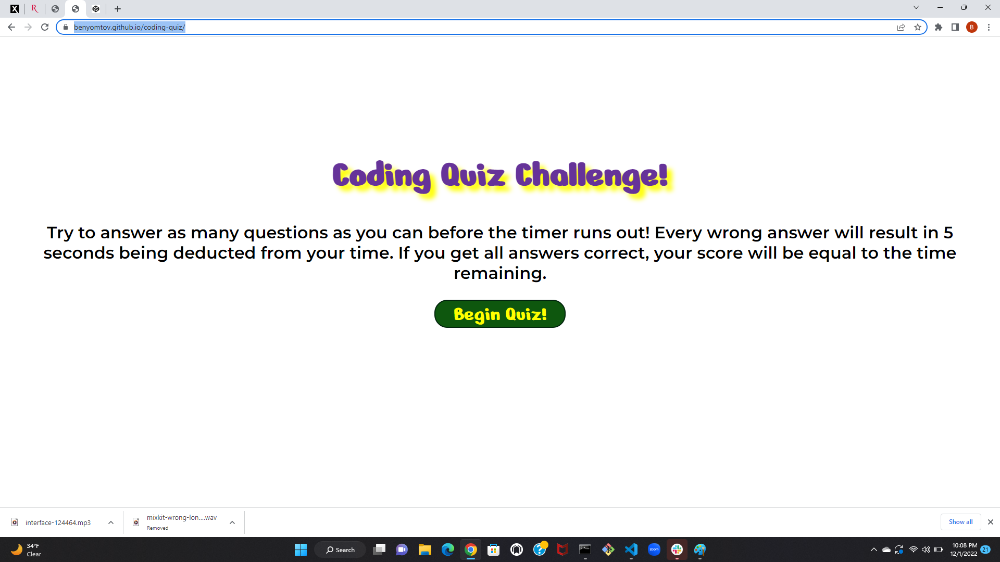
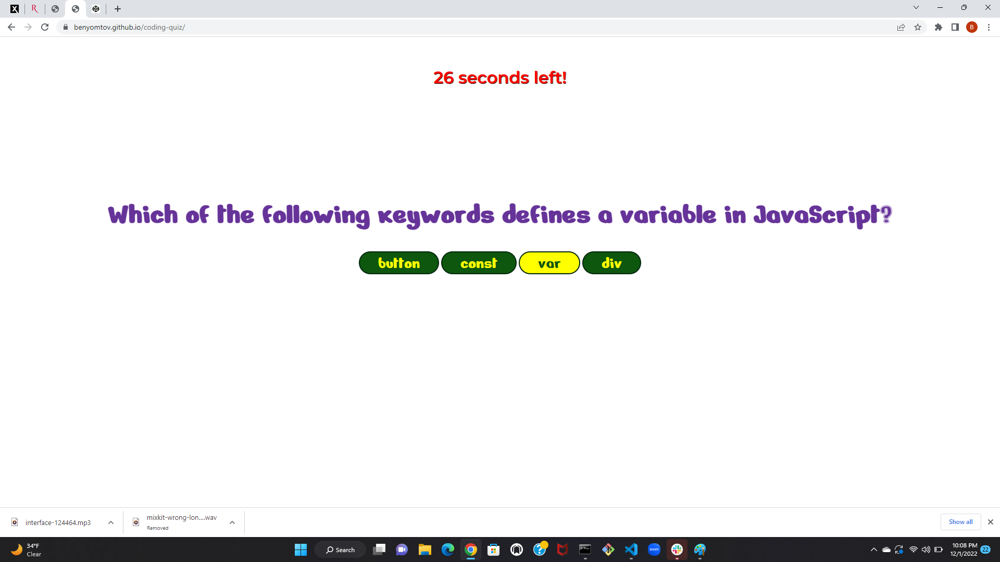
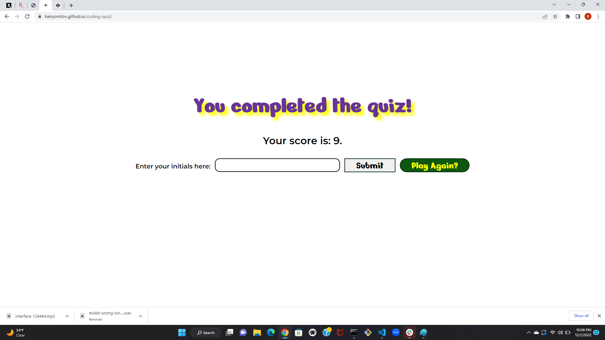
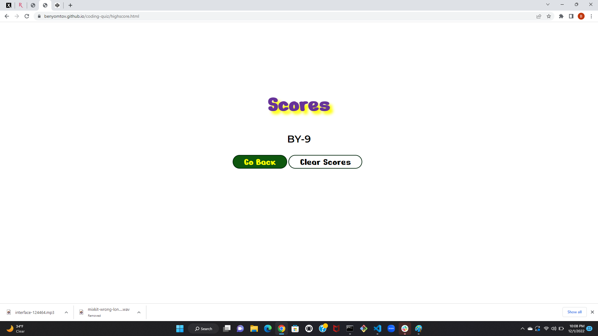

# Coding Quiz

## Description

Provide a short description explaining the what, why, and how of your project. Use the following questions as a guide:

This application is a coding quiz designed to assess the user on their knowledge of Javascript. The quiz is timed, and has five multiple choice questions. If the user can answer all five questions correctly, they win and can enter their name and score where it will be saved on the score page of the application.

## Installation

This application can be visited on any browser at https://benyomtov.github.io/coding-quiz/.

## Usage

Upon opening the application, the user can click the "Begin Quiz" button to start the coding quiz. On each question screen, there are four buttons with answers that can be clicked. The correct button will take the user to the next question, and the incorrect buttons will take 5 seconds off of the users time/score. The winning, losing, and score screens all have buttons that restart the application. The winning screen also has a input where the user can type their name so it will save with their score, as well as a display of the user's score. The user can then submit their name/score by clicking the "Submit" button and be taken the the scores page of the application. The score page shows the scores saved in local storage, and there is a button to clear the scores.

## Credits

Created by Ben Yomtov

Google Fonts were used for this application.
Fonts Used: 

Nerko One
Designed by Nermin Kahrimanovic

Montserrat
Designed by Julieta Ulanovsky, Sol Matas, Juan Pablo del Peral, Jacques Le Bailly

https://www.w3schools.com/ was also consulted to learn the code required for this project.

Sounds sourced from https://mixkit.co/free-sound-effects/buzzer/ and https://pixabay.com/sound-effects/search/correct/.

## License

No license.
